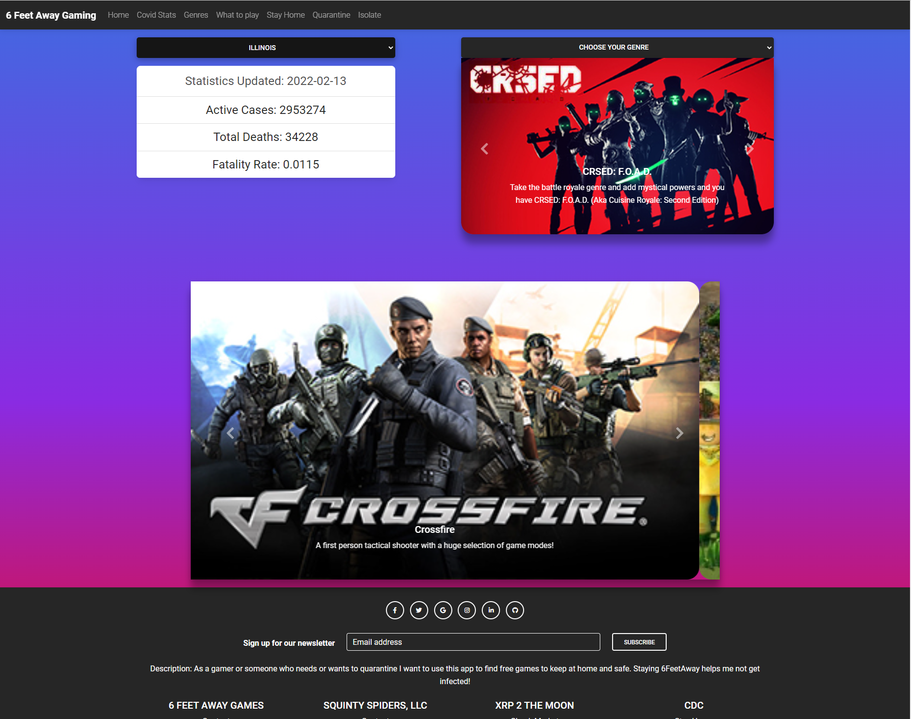

# squintspiders
- Gaming and finding covid stats website

# Purpose
- Game recommendations and covid alert.

Hello world!!! 

The 6FeetAway Gaming application allows users to find regional based COVID statistics and find free-to-play games,
while on quarantine. The user can select a state to recieve relevant COVID stats and select a genre to cycle through various games. 
On the bottom users can cycle through a carousel of games available on the free to play games API. Finally, the application provides links to CDC resources regarding quarantine guidelines.

 Whether you are experiencing symptoms or not, 6FeetAway Gaming will help you find a reason to stay-home, and help you find something to play!
 Give it a try and find reason to stay home and game!

Game recommendations and covid alert.
Project 1 - Api App. It's an app that shows you Covid-19 stats and then gives you a reason to stay home and not get the virus  :    +1::skin-tone-3:

# Built With
*HTML *CSS *JavaScript

# Website
 https://ulisesrosas.github.io/6-FeetAway-Gaming/

 
 

# Contribution
Made by [Ulises Rosas] [Christian Lemuel Ruiz] [Michael Cortez-Mejia] and [Levi Jones]

